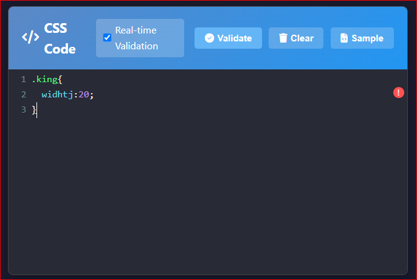
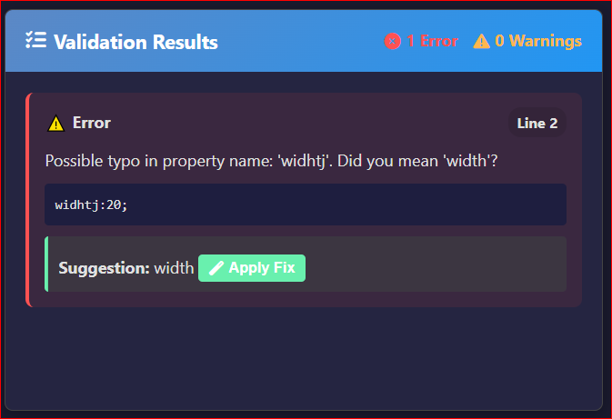
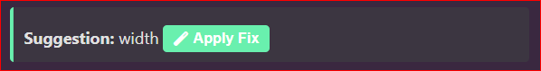
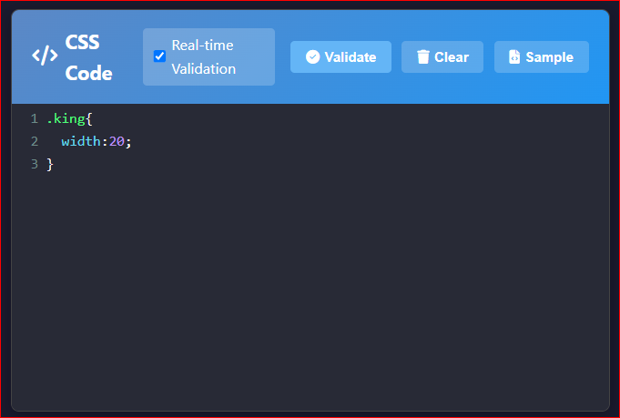

# CSS Error Detector

## Description
CSS Error Detector is a real-time CSS validation tool powered by Nord.js. It allows users to paste or write CSS code and instantly detect errors like typos, invalid properties, and syntax issues. It also offers smart suggestions and one-click fixes to help clean up your stylesheets.

## Features
- Real-time CSS error detection
- Powered by Nord.js for accurate validation
- Detailed error messages with line numbers
- Suggests corrections for common mistakes
- One-click "Apply Fix" functionality
- Clean and intuitive user interface

## Installation Instructions
1. Clone the repository:
   ```bash
   git clone https://github.com/RizwanAli-IT/CSS-Error-Detector.git

2. Navigate to the project directory:
   ```bash
   cd CSS-Error-Detector

3. Install dependencies:
   ```bash
   npm install

4. Start the application:
   ```bash
   npm start

5. Open your browser and visit:
   ```bash
   http://localhost:3000

## How It Works

- Step 1: User inputs incorrect CSS code like `widhtj:20;`

  

- Step 2: The validator highlights the error and shows a detailed message.

  

- Step 3: Click "Apply Fix" to automatically correct the mistake.

  
  
- Step 4: Error Resolved

  


